# R1 Trading Frontend Fixture Visual Acceptance

- Captured: 2026-07-16T11:02:21.828Z
- Runtime: `VITE_USE_MOCK=false` verified in the browser
- API data: Playwright route fixtures for DailyDecision V2, raw/effective fills, adjustments, and correction mutations
- Evidence scope: frontend state, visual, append-only correction interaction, accessibility, and scroll behavior only
- Does not prove: Task6 live backend persistence/E2E or production data correctness
- Strategy: `seed_etf_industry_rotation`
- Account: `paper-r1`

## desktop (1536x900)

### blocked

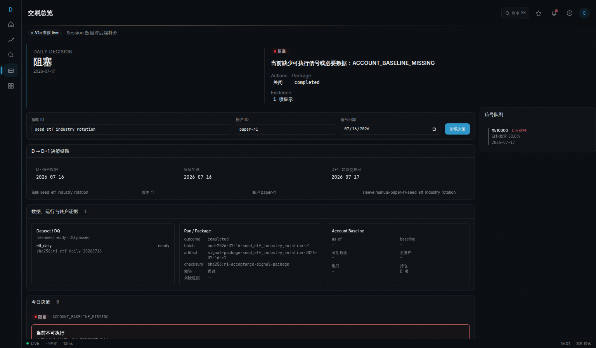

- live mode verified without prototype/MSW fallback
- body has no horizontal overflow
- blocked readiness label is visible
- blocked reason is announced and trade suggestions stay hidden
- Trading main content responds to vertical wheel scrolling
- page title, session strip, and readiness label remain in the captured viewport

### review

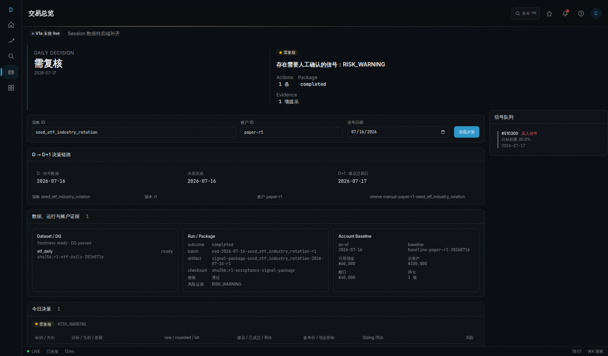

- live mode verified without prototype/MSW fallback
- body has no horizontal overflow
- review readiness label is visible
- wide action table is horizontally scrollable and keyboard focusable
- Trading main content responds to vertical wheel scrolling
- page title, session strip, and readiness label remain in the captured viewport

### review-fills

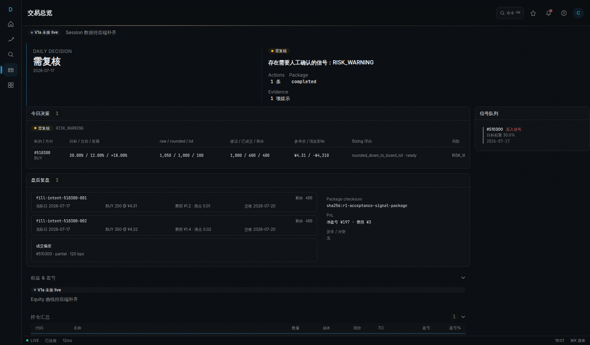

- two effective fills are visible for one intent
- remaining quantity and PnL come from the Playwright network fixture response

### ready

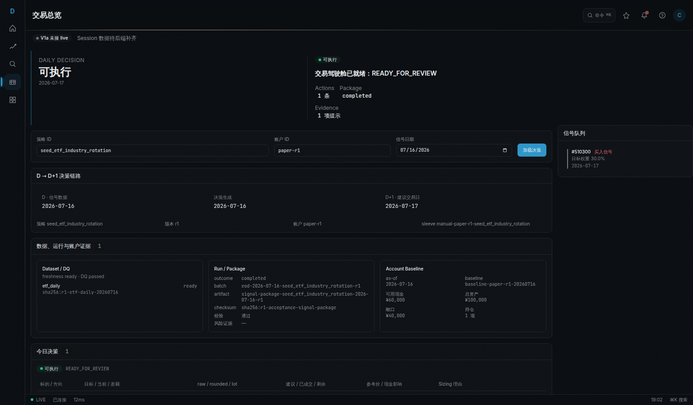

- live mode verified without prototype/MSW fallback
- body has no horizontal overflow
- ready readiness label is visible
- wide action table is horizontally scrollable and keyboard focusable
- Trading main content responds to vertical wheel scrolling
- page title, session strip, and readiness label remain in the captured viewport

### fill-review

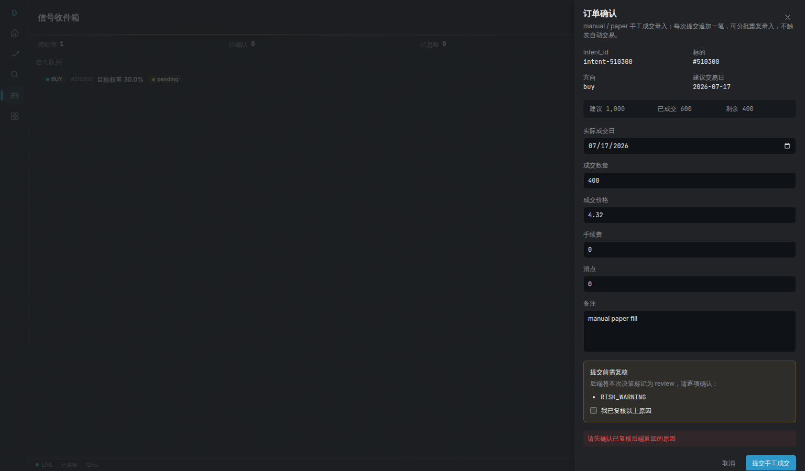

- keyboard focus enters the dialog
- review reason, filled quantity, and remaining quantity are visible
- submission is gated until review confirmation
- the submit action stays reachable and overflow states scroll when needed
- captured dialog starts with its title, intent, and instrument context
- Escape closes the dialog and restores trigger focus

### multi-fill-ledger

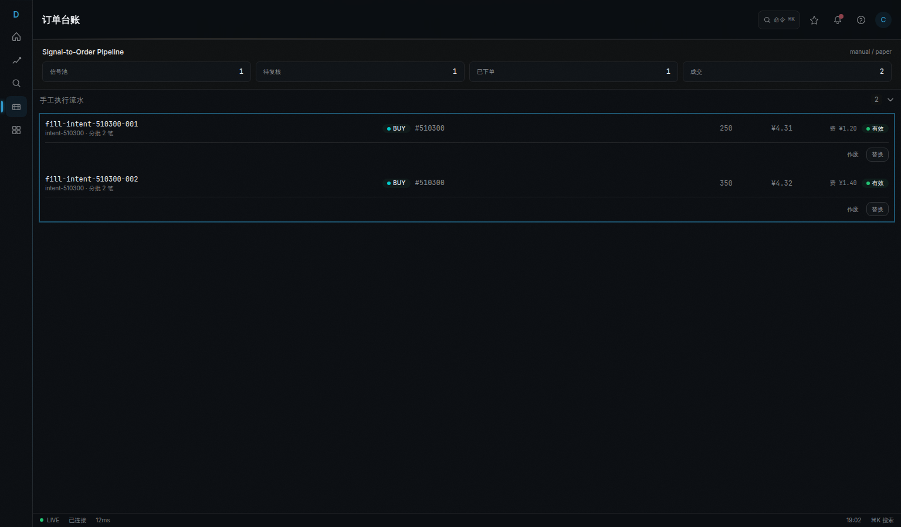

- two fills for one intent are visible
- fill ledger is keyboard focusable

### fill-correction

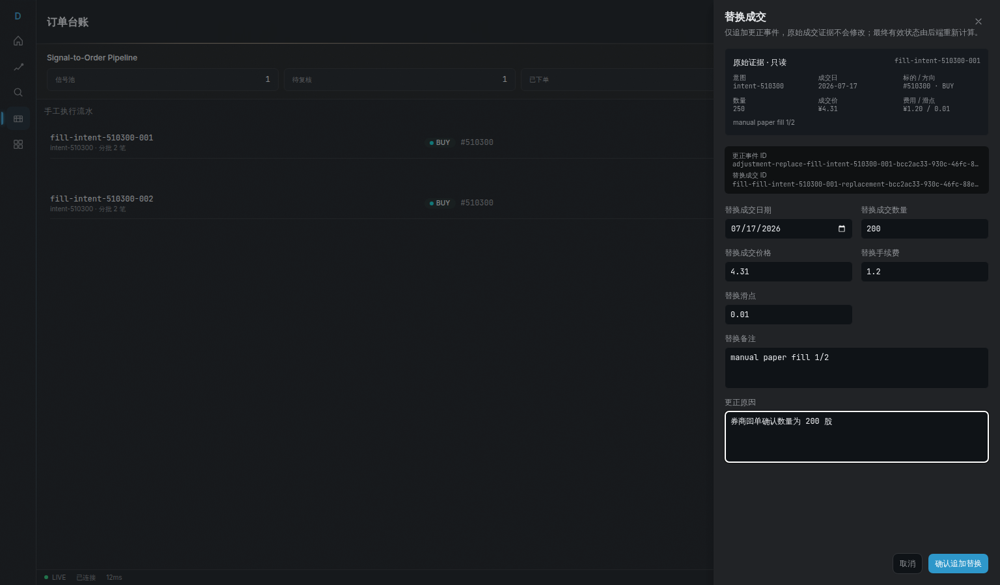

- live mode uses Playwright API fixtures without MSW or prototype fallback
- correction Sheet keeps immutable raw evidence visible
- replacement fields are prefilled and remain usable on this viewport
- captured Sheet starts at its title and immutable evidence
- generated idempotency keys and replacement payload are posted
- fixture refetch keeps the raw original visible as replaced and links the effective replacement
- this evidence does not assert live backend persistence
## mobile (390x844)

### blocked

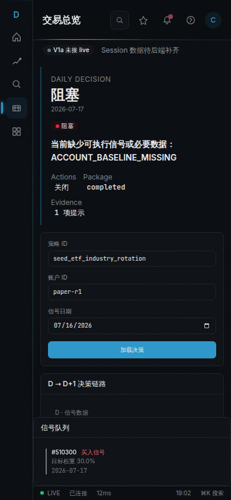

- live mode verified without prototype/MSW fallback
- body has no horizontal overflow
- blocked readiness label is visible
- blocked reason is announced and trade suggestions stay hidden
- Trading main content responds to vertical wheel scrolling
- mobile signal queue is a separate grid row and does not overlap the scrollable main region
- page title, session strip, and readiness label remain in the captured viewport

### review

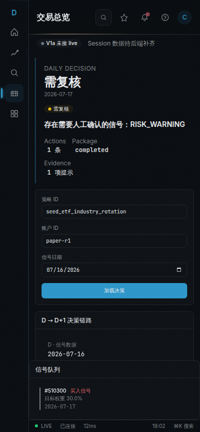

- live mode verified without prototype/MSW fallback
- body has no horizontal overflow
- review readiness label is visible
- wide action table is horizontally scrollable and keyboard focusable
- Trading main content responds to vertical wheel scrolling
- mobile signal queue is a separate grid row and does not overlap the scrollable main region
- page title, session strip, and readiness label remain in the captured viewport

### review-fills

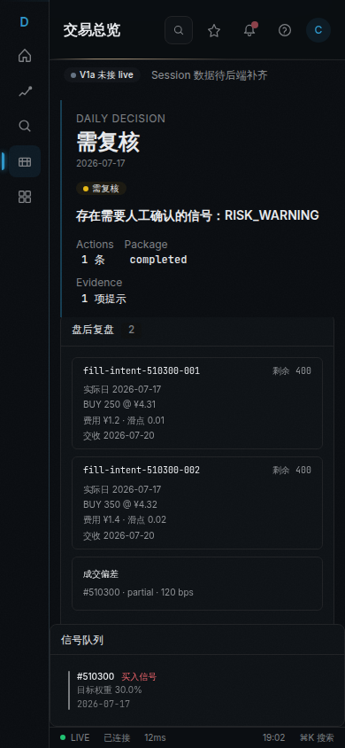

- two effective fills are visible for one intent
- remaining quantity and PnL come from the Playwright network fixture response

### ready

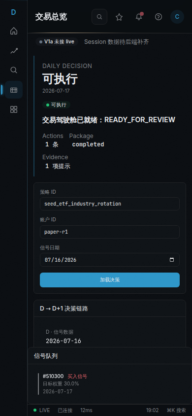

- live mode verified without prototype/MSW fallback
- body has no horizontal overflow
- ready readiness label is visible
- wide action table is horizontally scrollable and keyboard focusable
- Trading main content responds to vertical wheel scrolling
- mobile signal queue is a separate grid row and does not overlap the scrollable main region
- page title, session strip, and readiness label remain in the captured viewport

### fill-review

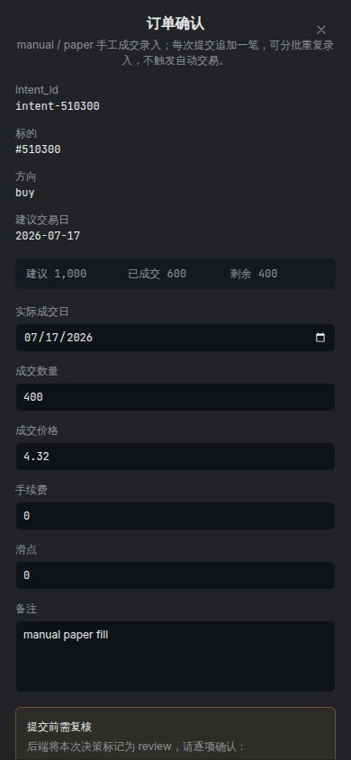

- keyboard focus enters the dialog
- review reason, filled quantity, and remaining quantity are visible
- submission is gated until review confirmation
- the submit action stays reachable and overflow states scroll when needed
- captured dialog starts with its title, intent, and instrument context
- Escape closes the dialog and restores trigger focus

### multi-fill-ledger

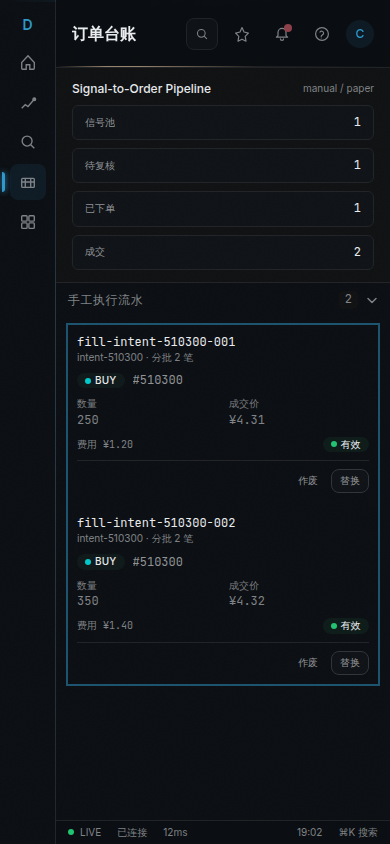

- two fills for one intent are visible
- fill ledger is keyboard focusable

### fill-correction

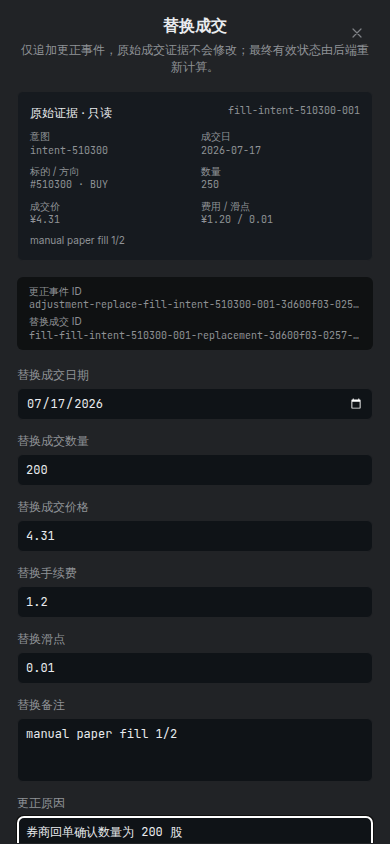

- live mode uses Playwright API fixtures without MSW or prototype fallback
- correction Sheet keeps immutable raw evidence visible
- replacement fields are prefilled and remain usable on this viewport
- captured Sheet starts at its title and immutable evidence
- generated idempotency keys and replacement payload are posted
- fixture refetch keeps the raw original visible as replaced and links the effective replacement
- this evidence does not assert live backend persistence
