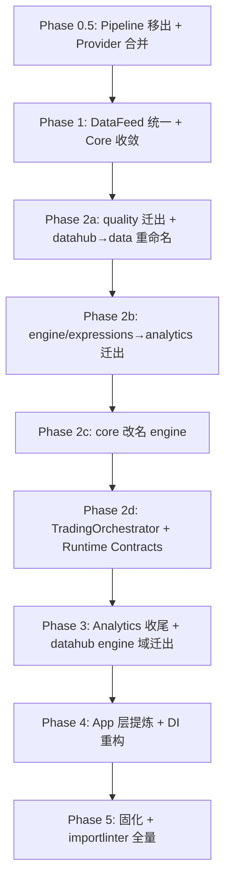

# refactor: Hybrid 平面架构 v2 迁移实施计划

**目标**：将 Ditto 从当前 5 包分层架构（kernel/infra/datahub/core/port）迁移至 Hybrid 平面架构（kernel/infra/data/engine/analytics/app + apps/interfaces），通过 Strangler 模式逐 Phase 推进。

**源文档**：[refined-requirements.md](../brainstorms/2026-03-31-hybrid-plane-v2-refined-requirements.md)

## 当前进度概览

> **审计日期**：2026-04-04 | **分支**：`refactor/phase4-app-layer-extraction` | **check**：4367+ tests ✅ | **arch-check**：18/18 KEPT ✅

| Phase | Unit | 状态 | 验证 |
|-------|------|------|------|
| 0.5a | Pipeline 移出 Kernel | ✅ 完成 | pipeline.py 已删、__init__ 已清、测试已删 |
| 0.5b | Provider 合并 → ServiceBackedDataProvider | ✅ 完成 | 110 行 Facade、10 个测试、零回退引用 |
| 0.5c | Phase 0.5 集成验证 | ✅ 通过 | check ✅ arch-check 8/8 ✅ |
| 1a | golden test 基线 | ✅ 完成 | 3 日 + 5 日场景、7 个指标硬编码断言 |
| 1b | ParquetDataFeed 清理 + 测试迁移 | ✅ 完成 | src/ 已清、TestParquetProvider × 2 conftest、零 ParquetDataFeed 引用 |
| 1c | Phase 1 集成验证 | ✅ arch-check 通过 | core-must-not-depend-on-datahub KEPT |
| 2a-1 | 创建 ditto_data + 迁移 quality/errors | ✅ 完成 | quality + errors → ditto_data，datahub errors re-export shim |
| 2a-2 | 迁移 quality 消费者 + 清理 core quality | ✅ 完成 | 83 测试迁移到 ditto_data，core quality 目录删除 |
| 2b-1 | 创建 ditto_analytics + 迁移 expression/materialization | ✅ 完成 | expression/ + materialization/ + compile_cache → ditto_analytics，re-export shim |
| 2b-2 | 迁移 analytics 消费者 + 清理 engine re-export | ✅ 完成 | 所有消费者切换到 ditto_analytics，shim 删除 |
| 2c-1 | ditto_core → ditto_engine 机械改名 | ✅ 完成 | 全库 0 ditto_core 残留，11/11 arch-check KEPT |
| 2c-2 | 文档更新 + 最终验证 | ✅ 完成 | CLAUDE.md + core/CLAUDE.md 更新 |
| 3a | 清理 deprecated 模型（trading.py + portfolio.py） | ✅ 完成 | 3 文件删除，__init__.py 清理，零残留 |
| 3b | factors + features 迁入 ditto_analytics | ✅ 完成 | re-export shim 兼容层，消费者零改动 |
| 3c | research 迁入 ditto_analytics + 消费者迁移 | ✅ 完成 | 9 消费者更新，shim 直接删除 |
| 4-5 | 路线图剩余 | ✅ 完成 | Phase 4 App 层提取 + Phase 5 AnyFrame 消除 + 收尾清理 |

---

## 问题框架

当前 Ditto 的分层架构存在三个结构性问题：

1. **Core 职责过载**：core 同时承载交易引擎、表达式计算、数据质量、回测引擎，违反单一职责
2. **Pipeline/Stage 类型安全为零**：Kernel 中的 `Any` 中转使 Pipeline 的核心价值（类型安全的 Stage 间契约）完全丧失
3. **BacktestProvider/LiveProvider 逐行复制**：80 行 × 2，零差异，维护成本翻倍

本计划覆盖 Phase 0.5（Pipeline 移出 + Provider 合并）和 Phase 1（DataFeed 统一 + Core 依赖收敛）的完整实施细节，以及 Phase 2-5 的路线图。

---

## 需求追溯

| Phase | 需求 | 验证方式 |
|-------|------|---------|
| 0.5 | R9, R10, R11 (Kernel 约束) | `pixi run -e dev arch-check` (kernel-isolation) |
| 0.5 | 审查文档 Issue #4 (BacktestProvider/LiveProvider 合并) | `pixi run -e dev test` |
| 1 | Phase 1 补完 (DataFeed 清理 + Core 收敛) | `pixi run -e dev arch-check` (core-must-not-depend-on-datahub) |
| 1 | S7 (回归验证) | golden test 基线对比 |
| 2-5 | R1-R8, R13-R36 | 里程碑验证表（见 origin 文档） |

**Phase 2-5 需求分步追溯**：

| Phase | Unit | 主要需求 | 新增 importlinter 规则 |
|-------|------|---------|----------------------|
| 2a | quality 迁出 + datahub→data 重命名 | R17 (data 统一包), R19 (storage-model 约束), R20 (sources-storage 隔离) | `data-storage-no-model-import`, `data-sources-no-storage-import` |
| 2b | expression/materialization → analytics | R34, R35, R36 (analytics 纯计算/无 I/O) | `analytics-no-datahub-import` |
| 2c | core 改名 engine | R1 (5 包结构) | 更新现有 layered-architecture |
| 2d | TradingOrchestrator + Runtime Contracts | R13-R16 (5 个 Runtime Contract), R22-R26 (Orchestrator), R27 (异常), R28 (EventBus 隔离) | `engine-no-data-import` (R7) |
| 3a | engine 域模型迁出 | R25 (Brokerage owner), R30 (事件定义归属) | `engine-model-ownership` |
| 3b | strategy 服务迁出 | R8 (app 互斥) | `app-query-no-command`, `app-command-no-query` |
| 3c | analytics 域模型迁出 | R34 (analytics 纯计算) | 已在 2b 覆盖 |
| 4a-b | app 包提取 + DI 重构 | R4 (app 上升), R8 (互斥) | `app-boundary` |
| 4c-d | port → interfaces | R5 (不独立 integration) | `interfaces-no-direct-data-import` |
| 5a | importlinter 全量 | R7 (禁止依赖), R8 (互斥), R17-R21 (data 内部) | 全部规则 + 清理 ignore_imports |
| 5b | AnyFrame 消除 | R12 | - |

---

## 已解决的规划问题

| 问题 | 决策 | 理由 |
|------|------|------|
| datahub→data 重命名时机 | Phase 2a 执行，带 re-export 兼容层 | Strangler 模式：先建适配层 → 迁移调用路径 → 最后删除旧路径 |
| R19 storage→model 现有违规 | Phase 2a datahub→data 迁移时建立 baseline + ignore_imports | datahub 中 ~30 处 storage→model import 需要逐步清理，先用 ignore_imports 锁定范围 |
| compile_cache 依赖链 | Phase 2b 随 analytics 迁出，consumers 改为导入 ditto_analytics | R36 已明确 compile_cache 归属 analytics |
| Phase 0.5 Pipeline 实际操作 | 删除（非迁移）— 零消费者确认 | grep 验证：全库仅 `__init__.py` re-export + test_pipeline.py |
| BacktestProvider/LiveProvider 合并策略 | 单一 `ServiceBackedDataProvider` + 构造参数区分 | 缓存不是 Provider 层职责，差异在编排不在数据获取。命名为 ServiceBacked（Facade 模式，组合 3 个 Service）而非 Adapter（非接口转换） |

---

## Phase 依赖关系



---

## Phase 0.5 — Pipeline 移出 Kernel + Provider 合并（3 PR）✅ 已完成

> **目标**：消除 Kernel 中无消费者的 Pipeline 抽象，消除 Provider 代码重复。
> **验收标准**：`pixi run -e dev check` 全通过 + arch-check 通过 + 零回退引用。
>
> **✅ 完成确认**（2026-03-31 审计）：3 个 Unit 全部完成。check 4228 tests ✅ | arch-check 8/8 KEPT ✅ | 零回退引用 ✅

### Unit 0.5a: 从 Kernel 删除 Pipeline/Stage/Context（PR 1）✅ 已完成

**理由**：Pipeline/Stage/Context 在全库零实际消费者（仅 `__init__.py` re-export + kernel 内部测试）。Phase 2d 在 engine 中按需重新定义强类型版本。当前保留只增加维护负担和误导性（R10）。

**修改文件清单**：

| 操作 | 文件 | 变更 |
|------|------|------|
| DELETE | [pipeline.py](../packages/kernel/src/ditto_kernel/pipeline.py) | 整个文件（83 行） |
| EDIT | [__init__.py](../packages/kernel/src/ditto_kernel/__init__.py) | 移除第 18 行 `from ditto_kernel.pipeline import ...` + `__all__` 中 `Context`, `Pipeline`, `Stage` 三个条目 |
| DELETE | [test_pipeline.py](../packages/kernel/tests/unit/test_pipeline.py) | 整个文件（208 行，7 个测试） |
| EDIT | [CLAUDE.md](../packages/kernel/CLAUDE.md) | 从模块结构中移除 `pipeline.py`；更新当前类型清单（移除 Context/Pipeline/Stage） |

**测试场景**：

| # | 场景 | 验证 |
|---|------|------|
| T1 | Kernel 导出正确 | `python -c "from ditto_kernel import Pipeline"` 抛出 ImportError |
| T2 | Kernel 仍可导入其他符号 | `python -c "from ditto_kernel import Clock, DataProvider, EventBus"` 正常 |
| T3 | Kernel 零依赖不变 | `pixi run -e dev arch-check` kernel-isolation 通过 |
| T4 | 类型检查通过 | `pixi run -e dev type --all` 零新增 error |
| T5 | 全量测试通过 | `pixi run -e dev test` 零新增 failure |

**importlinter 影响**：无。Pipeline 模块在 kernel 内部，不涉及跨包依赖。

---

### Unit 0.5b: 合并 BacktestProvider + LiveProvider → ServiceBackedDataProvider（PR 2）✅ 已完成

**理由**：两个类 80 行逐行复制，零差异。缓存不是 Provider 层职责，回测/实盘差异在编排行为（Clock、Pipeline 控制流）不在数据获取（审查文档 Issue #4）。

**修改文件清单**：

| 操作 | 文件 | 变更 |
|------|------|------|
| REWRITE | [provider.py](../packages/data/src/ditto_data/query/provider.py) | 删除 BacktestProvider + LiveProvider（类体共 172 行），替换为单一 `ServiceBackedDataProvider`（~50 行） |
| EDIT | [query/__init__.py](../packages/data/src/ditto_data/query/__init__.py) | 导出 `ServiceBackedDataProvider`，移除 `BacktestProvider` / `LiveProvider` |
| REWRITE | [test_backtest_provider.py](../packages/data/tests/unit/test_backtest_provider.py) | 重命名为 `test_service_backed_provider.py`，更新所有 `BacktestProvider` → `ServiceBackedDataProvider` |

**ServiceBackedDataProvider 设计**（Facade 模式 — 组合 3 个 Service，满足 DataProvider Protocol）：

```text
class ServiceBackedDataProvider:
    """组合 MarketService + MetadataService + DerivedQueryService 的 DataProvider 实现。

    命名为 ServiceBacked（Facade 模式）而非 Adapter（非接口转换）。
    """
    def __init__(self, *, market_service, metadata_service, derived_service): ...

    def get_bars(self, query: BarQuery) -> AnyFrame: ...
    def get_instruments(self, query: InstrumentQuery) -> AnyFrame: ...
    def get_schedule(self, start: str, end: str) -> AnyFrame: ...
    def get_factor(self, name: str, instruments: tuple[str, ...], start: str, end: str) -> AnyFrame: ...
```

> 注：如果未来实盘需要缓存，用 decorator 或 composition 注入，不继承。

**消费者影响分析**：

| 消费者 | 导入路径 | 影响评估 |
|--------|---------|---------|
| `ditto_data.query.__init__` | re-export | 低 — 仅更新导出名 |
| `ditto_core.backtest.data_feed:200` | docstring 引用 | 低 — 仅更新注释 |
| `apps/port/` | 无导入 | 无影响 — grep 确认零引用 |

**测试场景**：

| # | 场景 | 验证 |
|---|------|------|
| T1 | get_bars ticker 解析 | mock metadata 返回 ticker→id 映射，验证委托给 MarketService |
| T2 | get_bars 空 instrument_ids 返回空 DataFrame | ticker 不在映射中时返回 `pl.DataFrame()` |
| T3 | get_instruments 委托 | 验证参数传递到 metadata.find_securities |
| T4 | get_schedule 委托 | 验证参数传递到 metadata.list_calendar_range |
| T5 | get_factor 委托 | 验证 ticker→id 解析 + derived.query_for_evaluation 调用 |
| T6 | 原有 11 个测试全部迁移 | 从 test_backtest_provider.py 的 11 个测试用例完整保留 |

---

### Unit 0.5c: Phase 0.5 集成验证（PR 3）✅ 已完成

**目标**：确保 PR 1 + PR 2 合并后系统完整性。

**验证清单**：

| # | 验证项 | 命令 | 通过标准 |
|---|--------|------|---------|
| V1 | 全量 check | `pixi run -e dev check` | lint + type + test 全通过 |
| V2 | arch-check | `pixi run -e dev arch-check` | 全部 8 个 contract 通过 |
| V3 | 零回退引用 | `grep -rn "from ditto_kernel.pipeline\|BacktestProvider\|LiveProvider" packages/ apps/ --include="*.py"` | 返回 0 结果 |
| V5 | 新名称生效 | `grep -rn "ServiceBackedDataProvider" packages/data/src/ --include="*.py"` | query/provider.py + query/__init__.py 引用正确 |
| V4 | Kernel __all__ 审计 | 检查 `ditto_kernel.__all__` | 15 个符号（原 18 减 3：Context, Pipeline, Stage 移除） |

---

## Phase 1 — DataFeed 统一 + Core 依赖收敛（2-3 PR）⚠️ 进行中

> **目标**：清理 Phase 1 遗留的 DataFeed 双路径，建立 Core 依赖收敛的 importlinter 基线，建立 golden test 回归基线。
> **验收标准**：`grep ParquetDataFeed` 返回 0 + arch-check core-must-not-depend-on-datahub 通过（当前已通过，验证无回退）+ golden test 基线建立。
>
> **✅ 进度**（2026-03-31）：Unit 1a ✅ | Unit 1b ✅ | Unit 1c ✅ — Phase 1 全部完成

### Unit 1a: 建立 golden test 基线（PR 4）✅ 已完成

**理由**：golden test 是后续所有 Phase 的回归安全网。必须在 DataFeed 统一前建立基线，否则无法区分"行为变更"和"DataFeed 切换"。

**修改文件清单**：

| 操作 | 文件 | 变更 |
|------|------|------|
| CREATE | [tests/integration/backtest/test_golden_baseline.py](../packages/engine/tests/integration/backtest/test_golden_baseline.py) | 新建 golden test，捕获回测关键指标 |
| EDIT | [conftest.py](../packages/engine/tests/integration/backtest/conftest.py) | 复用现有 three_day_data_feed fixture（或新增 1 年 ETF fixture） |

**Golden test 设计**：

```text
策略: ETF 等权重（5 只 ETF，月度调仓）
周期: 使用现有 three_day 或 five_day parquet fixture（开发验证用）
  → 注意：需求文档要求 1 年数据验证，但当前无 1 年 fixture。
    先用现有短周期 fixture 建立 framework + snapshot 机制，
    Phase 2 后有足够迁移基础再扩展为 1 年数据。
捕获指标:
  - 年化收益率 (annual_return)
  - 最大回撤 (max_drawdown)
  - 夏普比率 (sharpe_ratio)
  - 总交易次数 (total_trades)
  - 最终 NAV

存储: 使用 inline-snapshot（已有 --snapshot 标记支持）
```

**测试场景**：

| # | 场景 | 验证 |
|---|------|------|
| T1 | 首次运行建立 snapshot | `pixi run -e dev test --snapshot` 生成 .snapshot 文件 |
| T2 | 后续运行验证不变 | `pixi run -e dev test` snapshot 对比通过 |
| T3 | 基线指标合理性 | 年化收益非零、最大回撤 < 100%、Sharpe 合理范围 |

---

### Unit 1b: ParquetDataFeed 清理 + Core 依赖收敛（PR 5）✅ 已完成

> **✅ 完成日期**：2026-03-31
> - ✅ `data_feed.py` 中 ParquetDataFeed 类已删除
> - ✅ `__init__.py` `__all__` 已移除 ParquetDataFeed
> - ✅ `test_parquet_data_feed_unit.py` 已删除
> - ✅ 集成测试：`TestParquetProvider` × 2 conftest（backtest + strategy），`build_test_data_feed()` helper
> - ✅ 4 个测试文件 import 迁移完成（test_golden_baseline / test_risk_integration / test_reproducibility / test_backtest_invariants）
> - ✅ 文档（CLAUDE.md/AGENTS.md/README.md）ParquetDataFeed → ProviderBackedDataFeed
> - ✅ `grep -rn "ParquetDataFeed" packages/ apps/ --include="*.py"` 返回 0

**理由**：Phase 1c 要求 DataFeed 统一在 ProviderBackedDataFeed 上。ParquetDataFeed 作为旧路径必须完全清理。

> **风险提示**：ParquetDataFeed 在 8 个文件中被使用（2 源码 + 6 测试文件）。测试文件中涉及 ~10 个 fixture 和 ~8 处 import 站点。此 PR 较大，需要仔细验证。

**影响范围分析**：

| 文件 | 使用方式 | 迁移策略 |
|------|---------|---------|
| [data_feed.py](../packages/engine/src/ditto_core/backtest/data_feed.py) | 定义 + ParquetDataFeed + ProviderBackedDataFeed | 删除 ParquetDataFeed 类，保留 ProviderBackedDataFeed |
| [backtest/__init__.py](../packages/engine/src/ditto_core/backtest/__init__.py) | 导出 ParquetDataFeed | 从 `__all__` 移除 |
| [conftest.py](../packages/engine/tests/integration/strategy/conftest.py) | 1 个 fixture | 转换为使用 mock DataProvider 的 ProviderBackedDataFeed |
| [conftest.py](../packages/engine/tests/integration/backtest/conftest.py) | 6 个 fixture (three_day/five_day/limit_up/limit_down/st) | 同上 |
| [test_backtest_invariants.py](../packages/engine/tests/integration/backtest/test_backtest_invariants.py) | 5 处局部 import + 构造 | 使用 conftest 中转换后的 fixture |
| [test_reproducibility.py](../packages/engine/tests/integration/backtest/test_reproducibility.py) | 2 处 import + 构造 | 同上 |
| [test_risk_integration.py](../packages/engine/tests/integration/backtest/test_risk_integration.py) | 1 处 import + 构造 | 同上 |
| [test_parquet_data_feed_unit.py](../packages/engine/tests/unit/backtest/test_parquet_data_feed_unit.py) | 专用单元测试 | 删除或迁移为 ProviderBackedDataFeed 测试 |

**迁移策略**：

集成测试当前使用 `ParquetDataFeed(parquet_dir=X, ...)` 直接读 parquet 文件。迁移到 `ProviderBackedDataFeed` 需要一个能从 parquet 文件读取数据的 DataProvider 实现。

**方案**：创建 `TestParquetProvider`（测试专用），放在 test conftest 中，将 ParquetDataFeed 的读文件逻辑包装为 DataProvider Protocol 实现。

> **关键洞察**：`ProviderBackedDataFeed` 只调用 DataProvider 的 `get_bars()` 和 `get_schedule()` 两个方法。`get_instruments()` 和 `get_factor()` 不被 `ProviderBackedDataFeed` 使用。

```text
# packages/core/tests/integration/backtest/conftest.py

class TestParquetProvider:
    """测试专用：从 parquet 目录读取数据，满足 DataProvider Protocol.
    仅 get_bars 和 get_schedule 被集成测试实际使用。
    """

    def __init__(
        self,
        parquet_dir: Path,
        id_map: dict[str, InstrumentId],
    ): ...

    def get_bars(self, query: BarQuery) -> pl.DataFrame:
        """读取 parquet 文件，拼接为 (trade_date, instrument_id, open, high, ...) 格式.
        ticker → instrument_id 映射通过 id_map 解析。
        """

    def get_schedule(self, start: str, end: str) -> pl.DataFrame:
        """从已加载的 parquet 数据中提取去重排序的 trade_date 列表,
        过滤 [start, end] 区间。返回 DataFrame(trade_date)。
        """

    def get_instruments(self, query: InstrumentQuery) -> pl.DataFrame:
        """返回空 DataFrame — ProviderBackedDataFeed 不调用此方法。"""

    def get_factor(self, name, instruments, start, end) -> pl.DataFrame:
        """返回空 DataFrame — ProviderBackedDataFeed 不调用此方法。"""
```

> **注意**：此 Provider 仅用于测试，不进入 src/。这避免了在 src 中保留 parquet 读取逻辑。

**fixture 转换示例**：

```text
# 旧: ParquetDataFeed(data_dir=dir, instrument_ids=IDS, start=X, end=Y)
# 新: ProviderBackedDataFeed(provider=TestParquetProvider(dir, id_map),
#                            tickers=("1", "2", "3"), start_date=X, end_date=Y,
#                            id_map=id_map)
```

`id_map` 可以直接从现有 `INSTRUMENT_IDS` 构造：`{"1": InstrumentId(1), "2": InstrumentId(2), ...}`。

**修改文件清单**：

| 操作 | 文件 | 变更 |
|------|------|------|
| EDIT | [data_feed.py](../packages/engine/src/ditto_core/backtest/data_feed.py) | 删除 ParquetDataFeed 类（约 90 行），更新模块 docstring |
| EDIT | [backtest/__init__.py](../packages/engine/src/ditto_core/backtest/__init__.py) | 从 `__all__` 移除 `"ParquetDataFeed"` |
| EDIT | [conftest.py](../packages/engine/tests/integration/strategy/conftest.py) | 新增 `TestParquetProvider`，转换 fixture |
| EDIT | [conftest.py](../packages/engine/tests/integration/backtest/conftest.py) | 同上，转换 6 个 fixture |
| EDIT | [test_backtest_invariants.py](../packages/engine/tests/integration/backtest/test_backtest_invariants.py) | 移除局部 `from ... import ParquetDataFeed`，使用 conftest fixture |
| EDIT | [test_reproducibility.py](../packages/engine/tests/integration/backtest/test_reproducibility.py) | 同上 |
| DELETE | [test_parquet_data_feed_unit.py](../packages/engine/tests/unit/backtest/test_parquet_data_feed_unit.py) | ParquetDataFeed 专用单元测试不再需要 |

**测试场景**：

| # | 场景 | 验证 |
|---|------|------|
| T1 | ParquetDataFeed 完全移除 | `grep -rn "ParquetDataFeed" packages/ apps/ --include="*.py"` 返回 0 |
| T2 | 集成测试全部通过 | `pixi run -e dev test --integration` 通过 |
| T3 | golden test 回归 | snapshot 对比通过，与 Unit 1a 基线一致 |
| T4 | Core 依赖收敛 | `pixi run -e dev arch-check` core-must-not-depend-on-datahub 通过 |
| T5 | 类型检查 | `pixi run -e dev type --all` 零新增 error |

---

### Unit 1c: Phase 1 集成验证（PR 6，可选）✅ arch-check 通过

**目标**：如果 PR 5 范围过大，拆分验证为独立 PR。

**验证清单**：

| # | 验证项 | 命令 | 通过标准 |
|---|--------|------|---------|
| V1 | DataFeed 清理 | `grep -rn "ParquetDataFeed" packages/ apps/ --include="*.py"` | 返回 0 |
| V2 | Core 依赖收敛 | `pixi run -e dev arch-check` | core-must-not-depend-on-datahub 通过 |
| V3 | Golden test 回归 | `pixi run -e dev test --integration` | snapshot 对比通过 |
| V4 | 全量 check | `pixi run -e dev check` | lint + type + test 全通过 |

---

## Phase 2-5 路线图

> 以下为高层路线图，每个 Phase 的详细实施计划将在前一 Phase 完成后展开。
>
> **全部已完成**（2026-04-04 审计确认）：4367+ tests, 18 importlinter contracts (0 broken)。

### Phase 2: Engine 平面成型（~8 PR）✅ 已完成

**前置**：Phase 0.5 + Phase 1 完成

| Unit | 内容 | 关键文件 | 依赖 |
|------|------|---------|------|
| 2a | `quality/` 迁入 data.quality + datahub→data 重命名（Strangler 模式，re-export 兼容层） | 12 个 quality 文件 + pyproject.toml + ~30 处 storage→model import + .importlinter 更新 | Phase 1 |
| 2b | `core/expression/` + `core/materialization/` + `compile_cache.py` 迁入 analytics | ~15 文件 + port consumers | 2a |
| 2c | `ditto_core` 改名 `ditto_engine` | pyproject.toml + 全库 import 更新 | 2b |
| 2d | TradingOrchestrator 设计 + Runtime Contracts + EventBus 隔离 + Stage 契约强类型 | engine.orchestrator/ 新建 | 2c |

**Phase 2 关键决策点**：

1. **datahub→data 重命名**（Unit 2a）：
   - 创建 `ditto_data` 包，pyproject.toml 声明
   - `ditto_data/__init__.py` 改为 re-export 层：`from ditto_data.models import *` 等
   - 逐步迁移模块，更新 import 路径
   - 全部迁移完成后删除 `ditto_data` 包

2. **compile_cache 依赖链**（Unit 2b）：
   - compile_cache.py 依赖 engine.expression + engine.materialization + engine.specs
   - 迁入 analytics 后，consumers（port/services/derived/、port/registry/datahub/derived.py）需要改为 `from ditto_analytics.compile_cache import ...`

3. **R19 storage→model 违规**（Unit 2a）：
   - datahub stores/ 中 ~30 处 `from ditto_data.models import ...`
   - 迁移到 data.storage/ 后，这些 import 变为 `from ditto_data.models import ...`
   - 新增 importlinter contract `data-storage-no-model-import`，先用 `ignore_imports` 锁定现有违规
   - 后续 Phase 逐步清理

**importlinter 演进**：

```ini
# Phase 2a 后新增
[importlinter:contract:data-storage-no-model-import]
name = Data storage must not import data models directly
type = forbidden
source_modules = ditto_data.storage.**
forbidden_modules = ditto_data.models.**
ignore_imports =
    ditto_data.storage.** -> ditto_data.models.common
    ditto_data.storage.** -> ditto_data.models.storage
    ditto_data.storage.** -> ditto_data.models.enums
    # ... 逐步收窄 ignore_imports
```

### Phase 3: Analytics 平面收尾 + datahub engine 域模块迁出（~5 PR）✅ 已完成

**前置**：Phase 2 完成

| Unit | 内容 | 关键文件 |
|------|------|---------|
| 3a | engine 域模型迁出（strategy.py, portfolio.py, trading.py → engine.alpha/portfolio/accounting） | datahub/models/ ~5 文件 |
| 3b | strategy 服务迁出（services/strategy/ → app.backtest/） | datahub/services/strategy/ ~4 文件 |
| 3c | analytics 域模型迁出（factors.py, features.py, research.py → analytics） | datahub/models/ + services/ ~6 文件 |
| 3d | derived 服务迁出（services/derived/ → app.materialization/） | datahub/services/derived/ ~10 文件 |
| 3e | Phase 3 集成验证 + importlinter 更新 | .importlinter |

### Phase 4: Application 层提炼（~7 PR）✅ 已完成

**前置**：Phase 3 完成

| Unit | 内容 |
|------|------|
| 4a | 提取 app 包（Use Case 编排） |
| 4b | DI 容器重构（Dishka composition root） |
| 4c | R8 app 互斥规则（module-per-role 结构） |
| 4d | port → interfaces 迁移 |
| 4e | 旧路径清理 + importlinter 全量 |

### Phase 5: 固化（~4 PR）✅ 已完成

**前置**：Phase 4 完成

| Unit | 内容 |
|------|------|
| 5a | importlinter 全量规则（含 data 内部约束、app 互斥） |
| 5b | AnyFrame 消除（R12 — DataProvider Protocol 移入 data/ 或 beartype runtime check） |
| 5c | 文档同步（所有 CLAUDE.md 反映最终架构） |
| 5d | 完整 CI 验证（`pixi run -e dev ci`） |

---

## 风险与缓解

| # | 风险 | 概率 | 影响 | 缓解 |
|---|------|------|------|------|
| K1 | ParquetDataFeed 集成测试迁移遗漏 | 中 | 高 | PR 5 中 grep 验证零引用 + golden test 回归 |
| K2 | datahub→data 重命名影响范围超预期 | 中 | 高 | Strangler 模式 + re-export 兼容层，分批迁移 |
| K3 | R19 storage→model 违规数量超预期 | 中 | 中 | ignore_imports 锁定 + 逐步清理，不阻塞迁移 |
| K4 | compile_cache consumers 迁移遗漏 | 低 | 中 | grep 验证 + type check |
| K5 | golden test 基线不稳定（浮点精度） | 低 | 低 | 使用 inline-snapshot 的近似比较模式 |

---

## 系统级影响

**受影响方**：

| 受影响方 | 影响 | 缓解 |
|---------|------|------|
| 全库开发 | Phase 2+ import 路径变更 | re-export 兼容层 + 分批 PR |
| CI/CD | arch-check 规则逐步演进 | 每个 Phase 更新 .importlinter |
| 测试 | 6 个测试文件（~10 个 fixture + ~8 处 import 站点）需要转换 | Phase 1 统一处理 |
| 文档 | CLAUDE.md 需要跟随架构更新 | 每个 Phase 末更新 |

---

## 完成标准

Phase 0.5 + Phase 1 完成后：

- [x] `grep -rn "from ditto_kernel.pipeline\|from ditto_kernel import.*\(Pipeline\|Stage\|Context\)" packages/ apps/ --include="*.py"` 返回 0 ✅
- [x] `grep -rn "BacktestProvider\|LiveProvider\|DataProviderAdapter" packages/ apps/ --include="*.py"` 返回 0 ✅
- [x] `grep -rn "ParquetDataFeed" packages/ apps/ --include="*.py"` 返回 0 ✅
- [x] `pixi run -e dev check` 全通过 ✅（4367+ tests）
- [x] `pixi run -e dev arch-check` 全部 contract 通过 ✅（18/18 KEPT, 0 broken）
- [x] golden test 基线建立并通过 ✅（3 日 + 5 日场景，硬编码断言）
- [x] Kernel `__all__` 从 18 降至 16 个符号 ✅（移除 Context, Pipeline, Stage）

**全量迁移最终状态**（2026-04-04 审计）：
- 4367+ tests passed
- 18 importlinter contracts (0 broken, 0 warnings)
- `from ditto_datahub`: 0 | `from ditto_core`: 0 | `from ditto_port`: 0
- `from ditto_engine`: 576+ 处 | `from ditto_analytics`: 173+ 处 | `from ditto_data`: 710+ 处
- 目录已重命名 `packages/core/` → `packages/engine/`

---

## 参考文档

- 源文档：[refined-requirements.md](../brainstorms/2026-03-31-hybrid-plane-v2-refined-requirements.md)
- 审查文档：[critical-review.md](../reviews/2026-03-31-hybrid-plane-v2-critical-review.md)
- v2 设计：[architecture-hybrid-plane-design.md](../plans/2026-03-30-architecture-hybrid-plane-design.md)
- v3 提案：[future-architecture-design.md](../plans/2026-03-31-ditto-future-architecture-design.md)
- Phase 0/1 实施：[phase0-1-implementation-plan.md](../plans/2026-03-30-phase0-1-implementation-plan.md)
