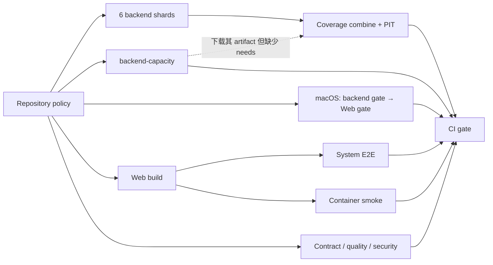

# Ditto CI 反馈周期审计（2026-09-26）

## 结论

现在最影响迭代效率的是**每次修复重复支付完整反馈周期，以及已知失败没有在下一次推送前被针对性验收**。不能把所有 CI run 当作 CR 轮次，也不能把所有失败当作实现行为缺陷。

- 六个重点 PR 的 83 个已结束 CI runs：每轮中位数 **11.80 分钟**，P90 **12.88 分钟**；首次调度中位数 **3 秒**。队列不是主要瓶颈。
- #307 的 11 轮连续失败都报告相同的 Web API 分支覆盖率 **89.95% < 90%**，每轮 **1,977 个行为测试通过**。本地 `check-web` 不运行 coverage，而 CI `web-quality` 运行 coverage；本地绿与远端绿的含义不同。
- 这 11 轮完整执行窗口合计 **131.87 分钟**、job 执行窗口合计 **1,069.48 runner-minutes**。前者是累加的 CI 服务窗口，不能直接当作可以净省下的用户等待墙钟；它仍足以说明重复确定性失败的成本。
- #304 的 17 轮 CI 全成功，#308 已结束的 20 轮也全成功。反复返工不是因为这些 CI 一直失败；需要用评论、修复提交和审查会话分析为什么测试绿后还有这么多修复。
- 单轮的当前主要关键路径是 **六个 backend shards → coverage 合并及串行 PIT → CI gate**；macOS 的串行 backend/Web 检查是次要、部分 runs 的最终瓶颈。setup/cache 不是主要瓶颈。
- 09-18 已落地的优化将本窗口全量 PR 成功首轮中位数从 **16.20 分钟（44 轮）**降至 **11.55 分钟（133 轮）**，约降低 **28.7%**。这是前后观测，样本代码和测试规模不同，不是受控因果实验。不能再用 09-12 的 16.4 分钟作为当前实测值。

本次只读采集和分析，只新增本文；没有修改 workflows/hooks/门槛，没有重跑 Actions，没有向 GitHub 写入。

## 数据范围与计算口径

### 查询与冻结快照

原始文件存于 `/tmp/ditto-review-ci-20260926/ci/`。仓库为 `cosmos-arc/ditto`，本地源码核对基线为 `main` 的 `f574a64516eb2cdf0da23e18d576511c11f11b51`。

查询超集为 UTC `2026-09-12T00:00:00Z..2026-09-26T23:59:59Z`，Actions API 分三页实际返回 **294 runs**：CI 286、依赖图等 dynamic runs 8。最后一个返回 run 创建于 `2026-09-26T08:20:59Z`。审计近 14 天的固定窗口采用 UTC **09-12 08:30 → 09-26 08:30**，从超集过滤后为 **283 runs，CI 275**；该时点后新产生或后来完成的结果不回填为当时已知事实。

近 14 天 CI 的 run 最新状态快照：

| Event | success | failure | cancelled | startup_failure | 进行中 | 合计 |
| --- | ---: | ---: | ---: | ---: | ---: | ---: |
| pull_request | 184 | 15 | 14 | 3 | 1 | 217 |
| push（main） | 54 | 1 | 1 | 0 | 0 | 56 |
| schedule | 0 | 1 | 1 | 0 | 0 | 2 |

超集 286 个 CI runs 的所有 attempts 共 **289 份 jobs 响应**已获取（286 首轮、3 次 attempt 2）。两个 502 已读请求重试成功，错误文本仍保留供审计。重点 PR #308/#307/#306/#304/#302/#288 共 **84 个 PR runs**，全部首轮 attempt，83 已结束、1 进行中；本文重点统计排除未完成那一轮。

主要原始文件：

- `runs-pages.json`：Actions runs 三页，含事件、SHA、attempt、状态。
- `run-<id>-attempt-<n>-jobs.json`：jobs 和步骤时间戳。
- `run-<id>-attempt-<n>.json`：有重跑的 run/attempt 元数据。
- `pr-<n>.json`、`pr-<n>-commits.json`、`pr-<n>-files.json`：重点 PR、提交和文件范围。
- `failed-job-<id>-logs.txt`：六个重点 PR 中所有实际失败业务 job 的日志，共 16 份；汇总 `CI gate` 的连带失败不当作新根因。
- `analyze.py`、`derived-rows.json`、`metrics.txt`：本次临时计算脚本和逐 run 结果；原始数据是权威，脚本只用于复算，不成为仓库新工具。

采集使用只读 `gh api`，例如：

```bash
gh api --paginate --slurp \
  'repos/cosmos-arc/ditto/actions/runs?per_page=100&created=2026-09-12T00%3A00%3A00Z..2026-09-26T23%3A59%3A59Z'
gh api --paginate --slurp \
  'repos/cosmos-arc/ditto/actions/runs/36228809385/attempts/1/jobs?per_page=100'
gh api 'repos/cosmos-arc/ditto/actions/jobs/108062213776/logs'
```

### 指标定义与边界

1. **首轮完整反馈窗口**：`max(已执行 job.completed_at) - run.created_at`。包含 initial queue、依赖等待、各阶段执行和 gate 收尾；不使用 `run.updated_at` 作为完成时间。
2. **初始调度等待**：`min(已执行 job.started_at) - run.created_at`。这只测第一个 job 的等待，不代表所有 runner 的排队情况。后置 job 等待 `needs` 是 DAG 内等待，不能用最后一个 job 的 started_at 减 run.created_at 当排队。
3. **job 时长**：`completed_at - started_at`，包括初始化、checkout、setup、执行、上传和收尾；步骤用自身时间戳再拆解。
4. **runner-minutes**：各实际 job 窗口求和，是逻辑 runner 使用时长，不是 GitHub 账单数，也不是用户串行等待时间。
5. **关键路径判定**：结合实际依赖图，检查 `CI gate` 前最后完成的业务 job。仅报“最长 job”不足以识别由多个串行 job 构成的路径。
6. **P90**：排序后 nearest-rank，取第 `ceil(0.9*n)` 个；P50 为普通中位数。样本不含 startup 无 jobs 的 runs 和尚未完成 runs。
7. **重跑**：Actions `attempts/2/jobs` 会包含沿用的首轮成功 job，甚至其 `run_attempt` 字段显示为 2。依靠该字段不能去重；只把 `started_at >= attempt.run_started_at` 的实际执行 job 计入本次重跑工作量，首轮分位数直接排除 attempt 2。
8. **成功样本的偏差**：最新状态成功不代表首轮成功。近 14 天 184 个成功 PR runs 中，两轮曾首轮失败后重跑成功，首轮成功样本为 182。只报成功分位数会低估失败修复成本，因此同时保留失败、取消和重点 PR 的所有完成状态。
9. **范围分类**：根据实际执行 job 组合标记全量（backend shards 与 Web quality 都执行）或轻量；不是单看总 job 数。旧 workflow 的 job 名改变已作兼容。重点六 PR 都涉及公共契约/跨栈等宽范围，没有证明这些 PR 是误分类。
10. **PR 时长与 CR 时长**：PR created→merged 是总存续期，CI 累加窗口不是该时长的可加分量；评论、审查可能发生在 PR 创建前，不能从 run 数、commit 数或评论条数直接推断 CR 轮次。

## 重点 PR 对照

以下都是 `pull_request` 触发，按 API 的 PR 关联或 PR 提交 SHA 匹配；不将 merge 后 main push 混入 PR 循环。

| PR | 已结束 runs / 进行中 | success / failure / cancelled | 完成窗口 P50 / P90 | 累加 CI 窗口 | 累加 runner-minutes | PR created→merged |
| --- | ---: | ---: | --- | ---: | ---: | --- |
| [#308](https://github.com/cosmos-arc/ditto/pull/308) | 20 / 1 | 20 / 0 / 0 | 12.44 / 13.82 min | 252.90 min | 1,961.23 | 当时 open，不计算 |
| [#307](https://github.com/cosmos-arc/ditto/pull/307) | 28 / 0 | 16 / 12 / 0 | 11.69 / 13.50 min | 336.65 min | 2,705.25 | 20h17m43s |
| [#306](https://github.com/cosmos-arc/ditto/pull/306) | 8 / 0 | 7 / 1 / 0 | 11.88 / 12.88 min | 95.50 min | 786.17 | 7h58m18s |
| [#304](https://github.com/cosmos-arc/ditto/pull/304) | 17 / 0 | 17 / 0 / 0 | 11.85 / 12.62 min | 201.17 min | 1,697.35 | 6h37m34s |
| [#302](https://github.com/cosmos-arc/ditto/pull/302) | 8 / 0 | 7 / 0 / 1 | 11.56 / 12.57 min | 91.75 min | 781.17 | 11h37m02s |
| [#288](https://github.com/cosmos-arc/ditto/pull/288) | 2 / 0 | 2 / 0 / 0 | 10.52 / 10.92 min | 21.05 min | 181.22 | 2h20m53s |

重点样本合计执行窗口 **999.02 分钟（16h39m）**。这不是六个 PR 的净可省时间；多个并行 job、实现工作、审查、休息、推送检查可能交叠。它衡量每次增量需要支付的 CI 服务成本。

## 确认的失败根因

### #307：相同 coverage 门重复失败 11 次

连续 SHA 不同、attempt 都为 1，所以不是同一 SHA 的 Actions 重试。每份日志都显示 `232 Test Files passed`、`1977 Tests passed`，然后同一个错误：

```text
ERROR: Coverage for branches (89.95%) does not meet
"src/features/*/api/**/*.{ts,tsx}" threshold (90%)
```

| Run | Head SHA 前缀 | 创建时间（UTC 09-25） | Web job 完成 | 整轮窗口 min |
| --- | --- | --- | --- | ---: |
| [36112826171](https://github.com/cosmos-arc/ditto/actions/runs/36112826171) | 8e4a9489 | 08:25:21 | 08:31:02 | 12.60 |
| [36115793365](https://github.com/cosmos-arc/ditto/actions/runs/36115793365) | 58b266dc | 08:58:01 | 09:03:05 | 13.80 |
| [36117726570](https://github.com/cosmos-arc/ditto/actions/runs/36117726570) | e1a4aa1e | 09:18:49 | 09:22:10 | 11.80 |
| [36120326505](https://github.com/cosmos-arc/ditto/actions/runs/36120326505) | 0b10b70e | 09:46:36 | 09:51:45 | 11.83 |
| [36121921302](https://github.com/cosmos-arc/ditto/actions/runs/36121921302) | 5695d73b | 10:04:00 | 10:09:04 | 12.37 |
| [36124516965](https://github.com/cosmos-arc/ditto/actions/runs/36124516965) | 9a15ac6e | 10:32:16 | 10:37:34 | 11.70 |
| [36125898936](https://github.com/cosmos-arc/ditto/actions/runs/36125898936) | 1a30341e | 10:47:44 | 10:52:52 | 11.67 |
| [36127497237](https://github.com/cosmos-arc/ditto/actions/runs/36127497237) | 28b2f877 | 11:05:27 | 11:10:45 | 11.55 |
| [36129482418](https://github.com/cosmos-arc/ditto/actions/runs/36129482418) | 6155c501 | 11:27:25 | 11:32:37 | 11.58 |
| [36130903129](https://github.com/cosmos-arc/ditto/actions/runs/36130903129) | c23bf2a8 | 11:42:58 | 11:46:46 | 11.45 |
| [36132300656](https://github.com/cosmos-arc/ditto/actions/runs/36132300656) | b4494b4f | 11:58:22 | 12:03:42 | 11.52 |

这些日志证明“同一个确定性门缺口连续存在”。不能据此推断开发者没看日志或有意忽略，也不能因为只差 0.05 个百分点就断言该分支没有价值；要检查遗漏分支的业务语义，再选择有意义的测试或简化不可达代码。

可确认的流程差异来自 `Taskfile.yml`：

- 本地 `check → check-web → web-static + web-test`。
- CI 的 Web job：`web-quality → web-static + web-coverage`。
- `web-coverage` 的 threshold 是真正阻断条件；`web-test` 通过不能证明 threshold 通过。
- `pre_push.py` 使用 remote→HEAD 的实际推送增量；没有发现始终对整 PR 差异重新选择的 bug。跨栈/高风险增量本来就选择宽门，因此继续做无关修复很容易再次付宽验证成本。

最小改进是：首次失败后先取失败日志，下一次修复首先复跑对应 `task web-quality` 或 coverage 入口确认该缺口关闭；不要继续以不同的本地绿声明替代。统一含义可以复用根 Task 的现有入口，无须新建第二套编排器、收据协议或仪表盘。

### 其他失败：输入/测试合同也需要诊断

- #306 初轮 [36039934846](https://github.com/cosmos-arc/ditto/actions/runs/36039934846)：Web branches **89.64% < 90%**；另一个 system test 用 `as_of=today` 与 `knowledge_cutoff=now.toISOString()`，API 返回 `422 / PORTFOLIO_PIT_CONTEXT_INVALID: knowledge_cutoff exceeds as_of`。日志支持时间上下文不一致，不能把 fail-closed 当作应该删除的门。
- #307 的 [36112826171](https://github.com/cosmos-arc/ditto/actions/runs/36112826171) 和 [36149040378](https://github.com/cosmos-arc/ditto/actions/runs/36149040378)：system test 在 `datetime-local` 输入 `.fill(...)` 时出现 `Malformed value`，位置是 ETF 配置复盘知识截止。后者是第 12 轮失败的根因；这与前 11 轮 coverage 是不同问题。
- #307 的 [36125898936](https://github.com/cosmos-arc/ditto/actions/runs/36125898936) 同时有 prototype 目标尺寸测试失败，打印 `markets-screener ... button 49.3x24`，预期无违规却得到一项。日志显示临界像素断言，实际未四舍五入尺寸/样式/渲染需针对性复现；仅凭打印四舍五入值不能判定是假阳性，更不能直接删除无障碍校验。

16 份失败业务 job 日志均已下载。本次没有重跑测试，因此这些归因止于日志能证明的失败路径，不把猜测包装为已复现或已修好。

## 当前 DAG 和单轮瓶颈

重点 83 个完成 runs 中，CI gate 前最后业务 job 为：backend coverage **65 次（78.3%）**，macOS **18 次（21.7%）**。不存在 api-contract 必须等待 backend shards 的依赖；它现在直接依赖 repository-policy。旧报告把多个晚启动阶段统称后置阶段，不能原样沿用为当前 DAG。



重点样本成功 job 的时长：

| 项目 | 样本数 | P50 | P90 | 解释 |
| --- | ---: | ---: | ---: | --- |
| 每轮最慢 backend shard | 83 | 8.35 min | 8.67 min | 六片中最慢，决定下游起点 |
| backend-capacity | 83 | 7.17 min | 7.40 min | 专门慢车道，真实测试占主要时长 |
| Backend tests and coverage | 82 | 2.81 min | 3.42 min | 必须等待 shards；PIT 串行加在其后 |
| macOS platform job | 82 | 10.24 min | 12.07 min | backend 和 Web 在同 job 顺序执行 |
| Web quality | 71 | 4.73 min | 5.03 min | 更早给出失败，但 gate 还等待其他 job |
| System E2E | 80 | 5.37 min | 5.82 min | 在 Web build 后启动，仍早于主要慢路径 |

对应步骤中位数：backend/Python setup 约 **19–24 秒**，macOS setup **32 秒**；coverage combine **33 秒**；后置 PIT **90 秒**；macOS backend gate **326 秒**、Web gate **229 秒**；system 真正执行 **272 秒**；Web CI **258 秒**。后端分片所有成功 jobs 的单片 P50 为 7.53 分钟（498 片），不是 cache 安装消耗七分钟。

例如最新已完成 #308 [36228809385](https://github.com/cosmos-arc/ditto/actions/runs/36228809385)：

- 08:06:56 创建，08:06:58 policy 启动，初始调度 2 秒。
- 08:07:12 起各片并行；最晚一片 08:15:32 完成。
- coverage job 08:15:35→08:19:16，PIT 单步 140 秒。
- macOS 08:07:16→08:17:38 已完成；gate 08:19:18→08:19:21。
- 全窗 12m25s 的主路径是 shards 加 coverage/PIT；移除 macOS 并不能让这轮直接减少十分钟。

### 一个独立正确性隐患

`backend-tests` 下载 `backend-capacity-${run_id}`，但 `needs` 只列 repository-policy 与 backend-shards。`ci-gate` 等待 capacity 并不能替代消费者 job 的直接依赖。若 capacity 慢于所有 shards，coverage 有可能在 artifact 未出现时失败；当前样本 capacity 通常更早完成，**没有将其归因为本次已观察失败或耗时**。应独立补齐显式 artifact 依赖，保留同 SHA/覆盖率完整性校验，不用 retry 隐藏竞态。

## 已优化内容、双跑与重跑

- [#162](https://github.com/cosmos-arc/ditto/pull/162) 已缩小普通后端 PR 的平台检查范围，缓存 Bun 与 Playwright；并不是所有高风险或跨栈 PR 都不跑平台。
- [#227](https://github.com/cosmos-arc/ditto/pull/227)（09-18，`75db8c50`）已将 scheduler capacity 分离为车道、4 片改 6 片、并行 lane 从 2 workers 改 4、线程池限 1，并收窄 main push。
- #227 后样本：全量成功 PR 首轮 **133 轮 P50 11.55 / P90 12.62 min**；轻量成功 PR **5 轮 P50 1.28 / P90 1.43 min**。近 14 天没有可确认的纯 Web/普通后端部分执行样本，不能推断其当前反馈分位数。
- #227 后的 34 个 main push 中，33 success、1 cancelled，实际仅 policy、安全常驻历史秘密扫描、跨平台验收和 gates；没有再跑六片 backend、Web coverage、system/container。这是已有的去重优化。成功 main push P50 **10.17 min**，主要是平台验收。
- `.github/workflows/README.md` 和 `docs/engineering/agent-harness.md` 仍写“main 全量”，与当前 `ci.py` 的 push 选择不一致。此文档漂移会使后续审查错误判断证据范围，需更新为实际政策或讨论是否恢复政策；不能默认悄悄改 CI。
- 超集没有同 `(event, head_sha)` 的两个不同 run IDs，也没有同 head SHA 同时出现在 push 和 PR 事件；三次 attempt 2 才是实际同 run/SHA 重跑。PR 的 head SHA、merge commit SHA 和临时合并执行 SHA 是不同身份，不能拿“合并后 main 再跑”直接称同 SHA 双跑。
- 三次重跑已拆 attempts；实际第二次执行只重跑少数失败及依赖 job，历史成功 job 被沿用。原始 endpoint 的重复描述不能再次累计为新执行成本。
- 取消能停止过期运行，但重点 PR 只有 #302 一轮取消；#304 17 轮和 #308 20 轮已结束均成功。很多推送在上一轮结束后才来，`cancel-in-progress` 无法追回已完成的时间。因此提高取消力度不解决主要串行循环。

## 按收益与风险排序的建议

| 优先级 | 建议 | 收益与风险 | 最小验收 |
| --- | --- | --- | --- |
| P0 | 每轮先读取上次真实失败；针对失败入口验证后再推送；本地与 CI 对“已通过”的措辞和命令保持一致 | 避免同一确定性缺口反复支付约 12 分钟；无需降低质量门。不要给所有纯后端修复强加全 Web coverage | #307 类 API 变更提交前运行既有 coverage 入口；下一 run 不再出现同一已知 signature |
| P0 | 本地把 format/lint/types/契约等便宜失败优先，再执行宽测试；保留同一根 Task 规则 | static failure 从几分钟后提前到秒级/一分钟；实际顺序不能用并行抢资源制造 flakes | 用真实 type/coverage 失败样本确认先给出明确失败，未运行的重测试诚实报告 |
| P1 | 一轮 review 批量收集、批量修复；代码阅读审查与 CI 并行，合并决定等待最终精确 SHA 证据 | 减少“一个 finding→一次宽 push→12m等待→一个 finding”的乘法项；仍保留修复审查 | 每 PR 独立记录实质修复批次数、失败 signature 复发、最终已验 SHA；不把 run 数当 review 数 |
| P1 | 补齐 backend-capacity artifact 的显式 needs；更正文档中的 main push 证据范围 | 降低未来竞态和审查误解；这是正确性修补，不声称大幅省时 | capacity 晚于 shards 时消费者仍等待；文档和选择器对照一致 |
| P2 | 将独立 PIT 专项提前并行，coverage job 只做证据合并；保留所有门和同 SHA 校验 | 切掉主要路径上约 90 秒的串行专项，macOS 可能接替关键路径；是中等收益 DAG 改动 | 实际复测整体 P50/P90，不能只报 PIT job 变快；gate 仍要求专项成功 |
| P2 | 根据 JUnit/`--durations` 重新平衡六片；审计现有 serial blanket（已有 [#226](https://github.com/cosmos-arc/ditto/issues/226)） | 从真实耗时切入，避免无限加分片；涉及隔离和并发安全，需先证明 serial 测试可并行 | 先定位少数慢组/串行缘由，完整 inventory/coverage 不缺片、不卡资金/PIT正确性 |
| P3 | 再评估 platform-sensitive scope 和 macOS backend/Web 串行职责 | 若仍需当前全量平台语义，拆 jobs 比删检查安全；仅在 macOS 关键路径时有整体收益 | 保留 native 行为和必要平台合同；比较整体改善和 runner 使用成本 |
| 暂不做 | 新仪表盘、跨 SHA 结果缓存协议、更多 runner、无限 retries、任意降 threshold、全局关 system/security | 当前证据不支持优先投入；增加维护负担或掩盖真实失败 | 只有前述措施仍不能达标且新测量证明瓶颈时再讨论 |

将 PIT 从 coverage 串行尾部移至独立并行的粗略反事实：在 82 个成功/失败完成重点 runs 上，仅把原 coverage 完成时刻减去其 PIT 步骤时长，再取其他 job 的最晚完成时刻，乐观收益 P50 **1.09 分钟**、平均 **0.91 分钟**、最大 **2.17 分钟**，其中 **18 轮收益为 0**（macOS 已决定结束时刻）。这个计算忽略新 job 的准备/排队和资源竞争，只是上界近似，不能直接承诺上线收益。六片最慢 P50 8.35 分钟与 macOS P50 10.24 分钟也说明，单改一个路径后另一路可能立即成为新瓶颈。

先处理重复失败和批次纪律，再优化单轮 DAG。单轮从 12 分钟降至 10 分钟当然有价值，但若仍串行经历 20 轮，就仍是 200 分钟量级；对本次真实样本，首先减少不产出新证据的循环，比再造一层 CI 系统更有杠杆。
